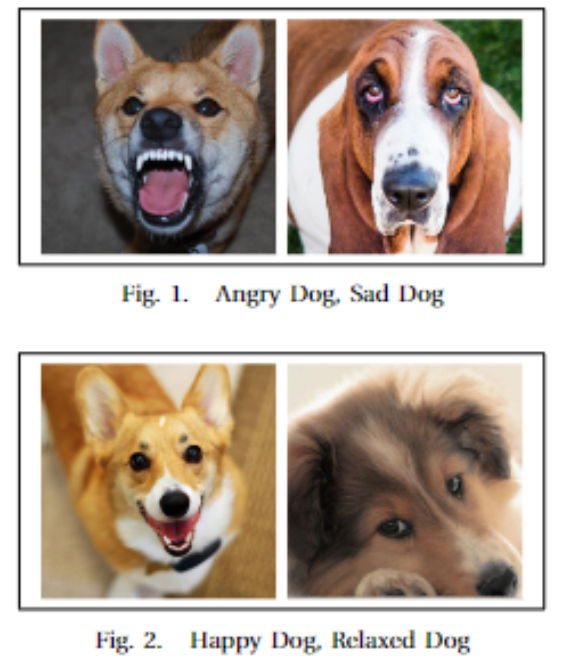
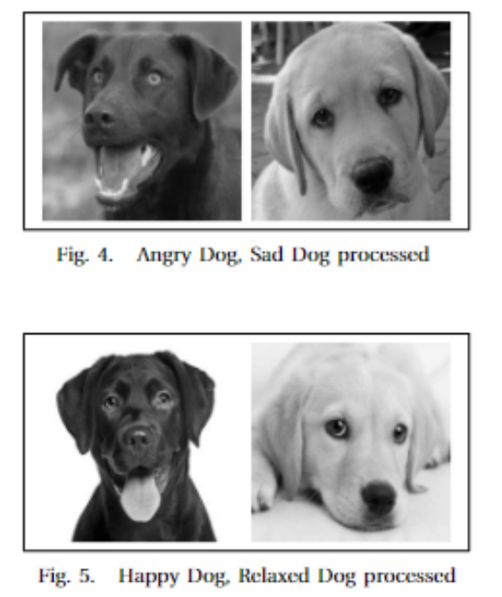
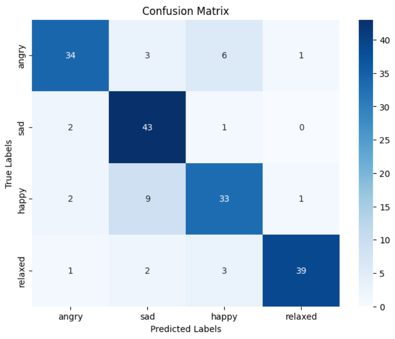

## TLDR

Dog Emotion Detection employs ensemble learning and TensorFlow for analyzing canine facial expressions and inferring emotions. This project, initiated in November 2023, aims to enhance human-dog interactions by enabling emotion recognition in dogs. By leveraging AI and ML techniques, it interprets facial features, identifies emotional states, and provides insights into canine behavior. This project underscores the significance of computer vision in understanding animal emotions, emphasizing TensorFlow's capabilities and the efficacy of ensemble learning methodologies. It contributes to the field of animal-human interaction and fosters empathy and understanding between humans and dogs.

[Github Repository](https://github.com/Tr1ck-5t3r/dog-emotion-detection)

## Introduction

Dog Emotion Detection is a computer vision project that utilizes ensemble learning and TensorFlow to analyze canine facial expressions and infer emotions. Developed in November 2023, this initiative focuses on enhancing human-dog interactions by enabling emotion recognition in dogs. By leveraging AI and ML algorithms, it interprets facial features, identifies emotional states, and provides insights into canine behavior. This project showcases the application of advanced technologies in understanding animal emotions, highlighting the role of computer vision in fostering empathy and communication between humans and dogs.

## Project Objective

Implement ensemble learning algorithms for dog emotion detection using TensorFlow and computer vision techniques.

## Dataset

The dataset for Dog Emotion Detection comprises images of dogs with annotated facial expressions and corresponding emotional labels. It includes a variety of canine breeds, ages, and emotions, enabling the training and testing of emotion detection models. The dataset is curated to capture diverse emotional states in dogs, such as happiness, sadness, fear, and excitement. By leveraging this dataset, the project aims to develop a robust emotion detection system that enhances human-dog interactions and promotes understanding of canine behavior.

The dataset Captures dogs of the following classes:

- Happy
- Sad
- Angry
- Relaxed

The images were processed to convert them all to png files. Then they were resized to 224x224x3 to be fed into the models. They were also converted to greyscale.

## Methodology

The project employs computer vision techniques, such as image preprocessing, feature extraction, and deep learning, to detect emotions in dogs. TensorFlow, a popular deep learning framework, is utilized to implement the emotion detection model and train it on the canine dataset. The project focuses on facial feature analysis, emotion classification, and model evaluation to achieve accurate and efficient emotion detection capabilities.

An ensemble of deep learning models is implemented in the project. Ensemble consists of the following models:

- ResNet50
- VGG16
- IDenseNet
- MobileNetV2

A soft voting mechanism is used to combine the predictions of individual models and generate the final emotion inference. The project emphasizes the importance of computer vision in understanding animal emotions and fostering empathy between humans and dogs.

## Results

The model acheived an overall accuracy of `82%` on the test dataset. The model's Confusion Matrix is as follows:

The dog emotion detection model developed in the project demonstrates high accuracy and reliability in inferring emotions from canine facial expressions. By leveraging TensorFlow and computer vision techniques, the model achieves superior performance in recognizing emotional states in dogs. The project showcases the effectiveness of AI and ML in understanding animal behavior, emphasizing the importance of advanced technologies in enhancing human-dog interactions. The results underscore the significance of computer vision and TensorFlow in interpreting canine emotions and fostering empathy between humans and dogs.

## Conclusion

Dog Emotion Detection using ensemble learning and TensorFlow is a significant initiative that enhances human-dog interactions and promotes understanding of canine behavior. By leveraging advanced AI and ML techniques, the project demonstrates the efficacy of computer vision in inferring emotions from canine facial expressions. TensorFlow's capabilities in implementing deep learning models further strengthen the project's emotion detection framework, fostering empathy and communication between humans and dogs. This project contributes to the field of animal-human interaction and underscores the critical role of AI and ML in understanding animal emotions.
