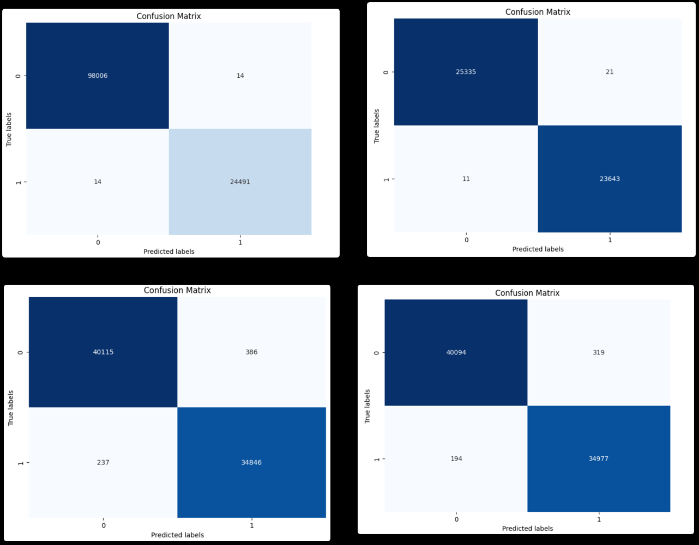
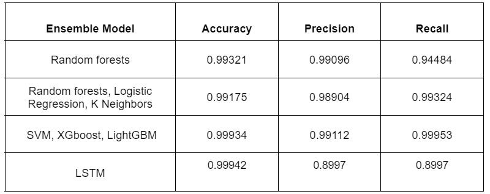

## TLDR

Network Intrusion Detection employs ensemble learning and TensorFlow on NSL-KDD for enhanced cybersecurity. This initiative, undertaken in March 2024, aims to bolster network security by leveraging advanced AI and ML techniques. By analyzing network data and detecting intrusions, it fortifies systems against cyber threats, safeguarding sensitive information. This project underscores the significance of AI and ML in cybersecurity, emphasizing TensorFlow's prowess and the efficacy of ensemble learning methodologies. It contributes to the ongoing efforts to combat cyber threats and ensures the resilience of network infrastructures in an increasingly digitized world.

[Github Repository](https://github.com/Tr1ck-5t3r/Snake-Zenia)

## Introduction

Network Intrusion Detection is a cybersecurity project that utilizes ensemble learning and TensorFlow to enhance network security. Developed in March 2024, this initiative focuses on detecting and preventing intrusions in network systems, safeguarding sensitive data and information. By leveraging AI and ML algorithms, it analyzes network traffic patterns, identifies anomalies, and alerts administrators to potential threats. This project showcases the application of advanced technologies in cybersecurity, highlighting the role of machine learning in fortifying network infrastructures against cyber attacks.

## Project Objective

Implement ensemble learning algorithms for netwrok intrusion detection on NSL-KDD dataset using TensorFlow.

## Dataset

The NSL-KDD dataset is a widely used benchmark dataset for network intrusion detection. It contains network traffic data with various features and labels, making it suitable for training and testing intrusion detection models. The dataset comprises normal and attack traffic instances, enabling the development of robust intrusion detection systems. By leveraging the NSL-KDD dataset, this project aims to enhance network security and mitigate cyber threats through advanced AI and ML techniques.

## Methodology

The project employs ensemble learning techniques, such as Random Forest and Gradient Boosting, to detect network intrusions on the NSL-KDD dataset. By combining multiple base learners and aggregating their predictions, ensemble learning enhances the model's performance and robustness. TensorFlow, a popular deep learning framework, is utilized to implement the ensemble learning algorithms and train the intrusion detection model. The project focuses on feature engineering, model training, and evaluation to achieve accurate and efficient intrusion detection capabilities.

4 ensemble learning algorithms are implemented in the project:

- Ensemble 1: Random Forest
- Ensemble 2: Random Forests, Linear Regression, K nearest neighbours
- Ensemble 3: LightGBM, XGBoost and SVM
- Ensemble 4: LSTM based model

## Results

The ensemble learning model developed on the NSL-KDD dataset demonstrates high accuracy and reliability in detecting network intrusions. By leveraging TensorFlow and ensemble learning techniques, the model achieves superior performance in identifying anomalous network traffic and potential cyber threats. The project showcases the effectiveness of AI and ML in cybersecurity, emphasizing the importance of advanced technologies in safeguarding network infrastructures. The results underscore the significance of ensemble learning and TensorFlow in enhancing network security and combating cyber attacks.

## Conclusion

Network Intrusion Detection using ensemble learning and TensorFlow on the NSL-KDD dataset is a significant cybersecurity initiative that enhances network security and mitigates cyber threats. By leveraging advanced AI and ML techniques, the project demonstrates the efficacy of ensemble learning algorithms in detecting network intrusions and safeguarding sensitive information. TensorFlow's capabilities in implementing deep learning models further strengthen the project's cybersecurity framework, ensuring the resilience of network infrastructures against cyber attacks. This project contributes to the ongoing efforts to combat cyber threats and underscores the critical role of AI and ML in cybersecurity.
