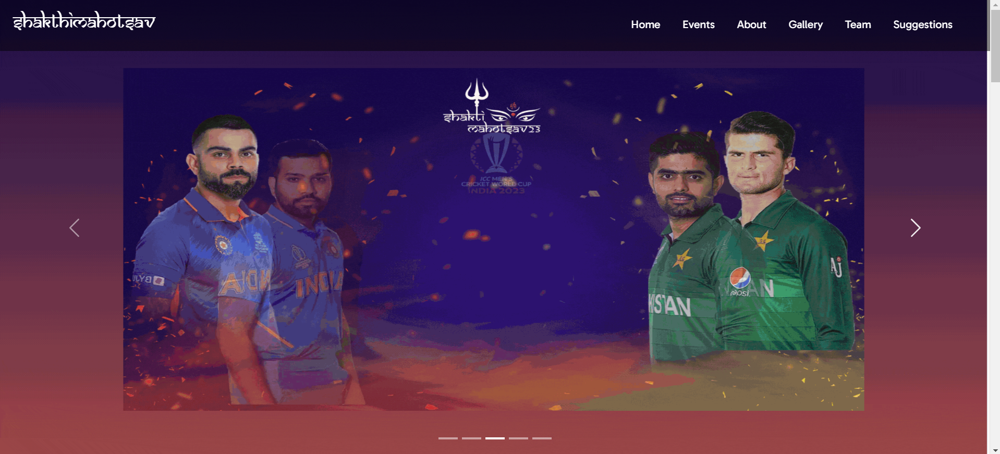
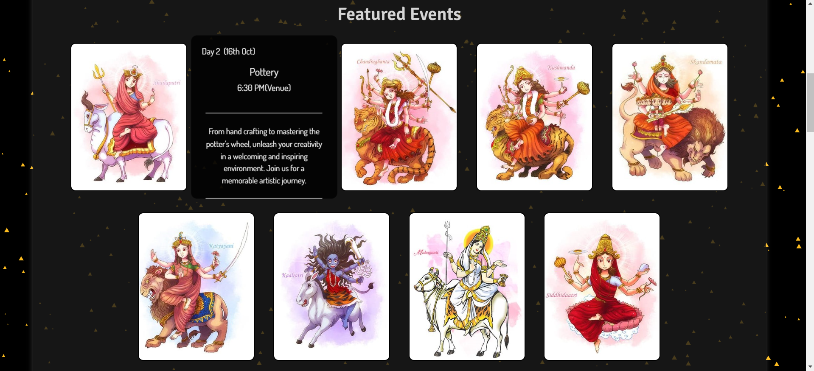
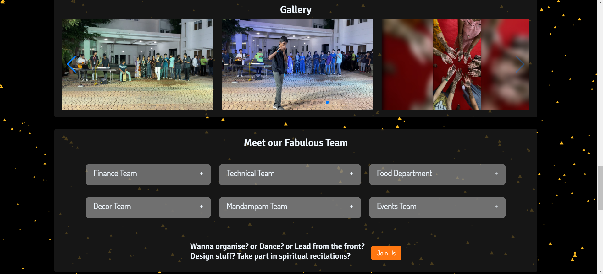
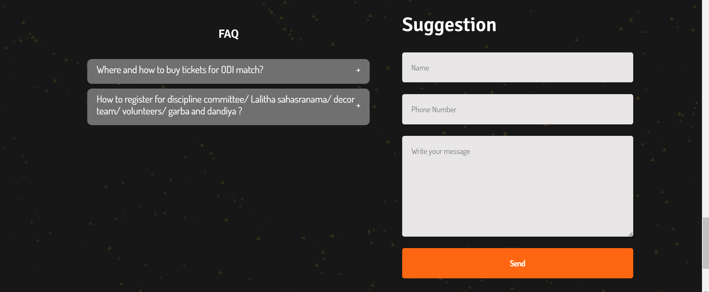

## TLDR

ShakthiMahotsav is a website developed for the Navratri Celebration in Amrita Vishwa Vidyapeetham, Chennai Campus. This project, initiated in May 2021, aims to provide information about the event, schedule, and activities during the festival. By leveraging web development technologies, it offers a platform for students and faculty to engage with the Navratri celebrations and participate in various events. This project underscores the significance of digital platforms in promoting cultural events and fostering community engagement. It contributes to the cultural heritage of the institution and enhances the festive spirit among the campus residents

[Github Repository](https://github.com/Tr1ck-5t3r/ShaktiMahotsav) | [Live Demo](https://intranet.ch.amrita.edu/sm23/)

## Introduction

ShakthiMahotsav is a web development project that serves as a platform for the Navratri Celebration in Amrita Vishwa Vidyapeetham, Chennai Campus. Launched in May 2021, this website aims to provide information about the festival, including the schedule, events, and activities planned during the celebration. By utilizing web technologies, it enables students and faculty to access details about the Navratri festivities, participate in cultural events, and engage with the campus community. This project highlights the role of digital platforms in preserving cultural traditions and fostering a sense of community among the campus residents.

## Project Objective

Develop a website for the Navratri Celebration in Amrita Vishwa Vidyapeetham, Chennai Campus, to provide information about the event, schedule, and activities during the festival. The website aims to engage students and faculty in the Navratri celebrations, promote cultural awareness, and enhance community participation.

## Website Sections

## Features

- Event Schedule: Display the schedule of events and activities planned for the Navratri Celebration.
- Registration: Allow students and faculty to register for various events and competitions.
- Gallery: Showcase images and videos from past Navratri celebrations and cultural performances.
- Contact Information: Provide contact details for event coordinators and organizers.
- Feedback Form: Collect feedback and suggestions from participants to improve future celebrations.
- Faq Section: Address common queries and provide information about the festival.
- Feedback Form: Collect feedback and suggestions from participants to improve future celebrations.

## Technologies Used

- Frontend: React(vite), HTML, CSS, JavaScript, Bootstrap, react responsive, ts-particles
- middleware: Node.js, Express.js, Axios
- Backend: PHP, MySQL, emailjs
- Hosting: Amrita Intranet Server
- Version Control: GitHub

## Conclusion

ShakthiMahotsav is a web development project that aims to promote the Navratri Celebration in Amrita Vishwa Vidyapeetham, Chennai Campus. By leveraging web technologies, this website provides a platform for students and faculty to access information about the festival, participate in cultural events, and engage with the campus community. It underscores the importance of digital platforms in preserving cultural traditions, fostering community engagement, and enhancing the festive spirit among the campus residents. This project contributes to the cultural heritage of the institution and strengthens the bond among the members of the Amrita family.
