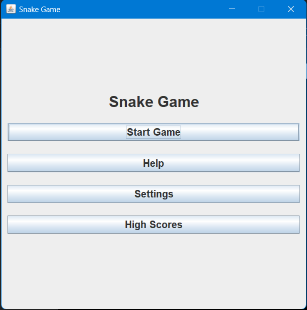
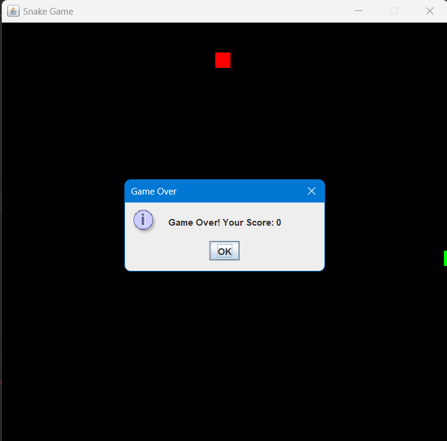
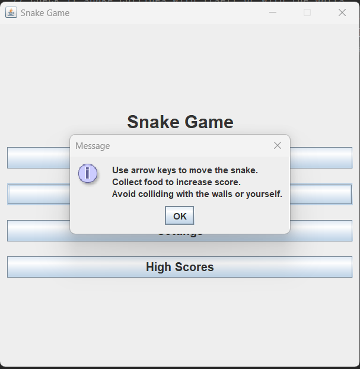
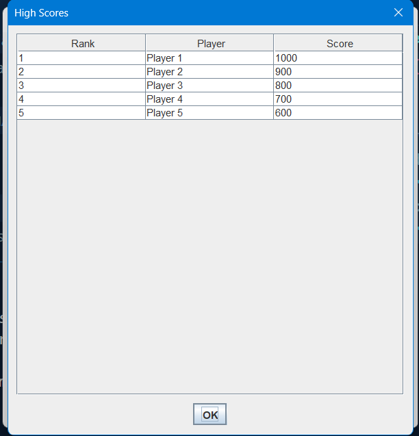

## TLDR

Snake Zenia, a Java applet crafted in May 2022, is a homage to the beloved snake game. It employs Java's prowess to recreate the classic gaming experience, complete with intuitive controls, vibrant visuals, and traditional gameplay mechanics. By simulating the snake's growth and movement dynamics, it demonstrates Java's adaptability in game development. Snake Zenia not only entertains but also educates, offering insights into Java applet programming and game logic implementation, making it a valuable resource for both enthusiasts and learners in the gaming community.

[Github Repository](https://github.com/Tr1ck-5t3r/Snake-Zenia)

## Introduction

Snake Zenia is a Java applet that emulates the classic snake game. This project, developed in May 2022, showcases the implementation of game logic and user interaction in Java. By recreating the iconic snake game, it demonstrates the versatility and functionality of Java applets in game development. This project serves as an educational resource for aspiring game developers and Java enthusiasts, highlighting the fundamental concepts and techniques involved in creating interactive games using Java.



### Game Features



- Classic snake game mechanics
- User-friendly interface
- Interactive gameplay
- High score tracking
- Customizable settings

#### Game Mechanics



Snake Zenia follows the traditional snake game mechanics, where the player controls a snake that grows in length as it consumes food items. The objective is to guide the snake to eat food while avoiding collisions with walls and its own body. The game ends when the snake collides with itself or the boundaries of the game board. Players can control the snake's movement using arrow keys or on-screen controls, enhancing the user experience and engagement.

### User Interface



The game features a user-friendly interface with intuitive controls and visual elements. Players can navigate the game board using arrow keys or on-screen controls, providing a seamless and interactive gaming experience. The interface displays the snake's length, score, and high score, allowing players to track their progress and performance. Additionally, the game board showcases vibrant colors and animations, enhancing the visual appeal and engagement of the game.

## How to play

- Clone the repository
- Open the project in an IDE
- Compile the files using the `javac` command

```bash
javac Homepage.java
javac SnakeGame.java
```

- Run the game using Homepage.java

```bash
java Homepage.java
```

## Conclusion

Snake Zenia is a testament to the enduring popularity and appeal of classic arcade games. By recreating the snake game in Java, this project highlights the versatility and creativity of game development using Java applets. It serves as a valuable resource for game developers and Java enthusiasts, offering insights into game logic, user interaction, and graphical interfaces. Snake Zenia exemplifies the timeless charm of arcade games and the innovative spirit of game developers, inspiring future projects and initiatives in the realm of game development.
